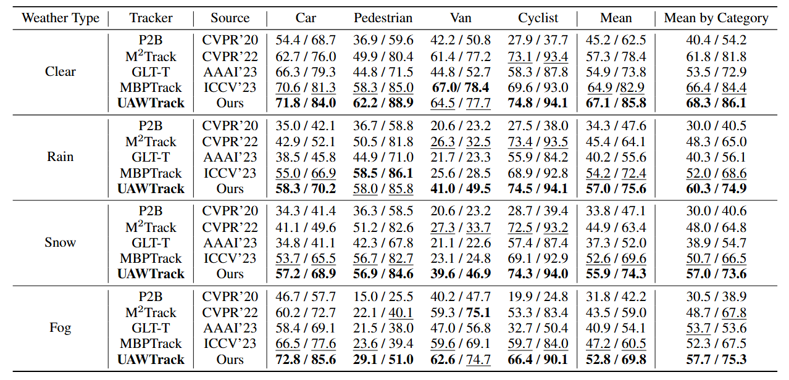
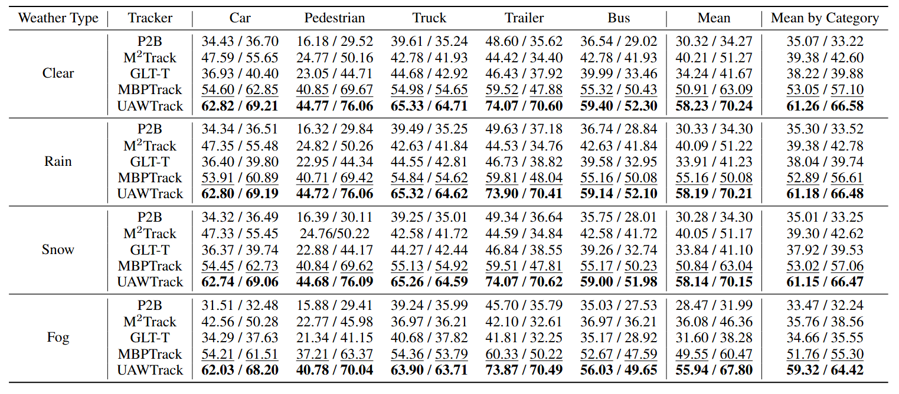

# UAWTrack

This repo is the official implementation of "UAWTrack: Universal 3D Single Object Tracking in Adverse Weather".

## :star:Overview

3D single object tracking (3D SOT) in LiDAR point clouds is essential for autonomous driving. Most existing 3D SOT methods focus on clear weather, where point clouds are more defined. However, adverse weather conditions lead to sparser and noisier point clouds, significantly degrading tracking performance and posing safety risks. In this study, we introduce UAWTrack, a universal 3D SOT model designed to perform effectively across diverse real-world weather conditions. UAWTrack comprises three key modules: 1) Voxel Feature Extraction, which mitigates the perturbations in point clouds caused by adverse weather; 2) Motion-centric Spatial-temporal Aggregation and Motion-guided Feature Fusion, capturing motion clues and sampling dense BEV motion features to address the issue of sparsity; and 3) Weather-Specific Tracker, which efficiently handles tracking in various weather conditions. To fill the gap of lacking benchmarks for 3D SOT in adverse weather, we simulate physically valid adverse weather conditions on the KITTI and NuScenes datasets, creating two benchmarks: KITTI-A and NuScenes-A. Extensive experiments demonstrate that UAWTrack achieves state-of-the-art performance under all weather conditions.

## :scroll:Datasets

To address the lack of datasets for 3D SOT under adverse weather conditions, we simulate physically valid weather on the KITTI and NuScenes datasets, generating two new datasets, KITTI-A and NuScenes-A. These datasets include three types of adverse weather — rain, snow, and fog — each with three intensity levels, as well as clear weather conditions. Below, we provide technical details on the simulated weather types, with visualization examples.

**Rain:** We simulate rain using the LISA technique on both KITTI and NuScenes datasets. Rainfall is categorized into three levels with rates set at {0.20, 1.5625, and 7.29}.

**Snow:** Snow simulation is also implemented using the LISA technique, with snowfall rates mirroring the rain intensities at {0.20, 1.5625, and 7.29}.

**Fog:** Fog datasets are generated by setting the attenuation coefficient to {0.005, 0.02, and 0.06} across three levels, based on the clear KITTI and NuScenes datasets.

## :crown:Main Results
### KITTI
<table>
<thead>
<tr>
<th align="center">Weather Type</th>
<th align="center">Tracker</th>
<th align="center">Source</th>
<th align="center">Car</th>
<th align="center">Pedestrian</th>
<th align="center">Van</th>
<th align="center">Cyclist</th>
<th align="center">Mean</th>
<th align="center">Mean by Category</th>
</tr>
</thead>
  
<tr>
<th align="center" rowspan="5" nowrap="nowrap">Clear</th>
<td align="center">P2B</td>
<td align="center">CVPR'20</td>
<td align="center">54.4/68.7</td>
<td align="center">36.9/59.6</td>
<td align="center">42.2/50.8</td>
<td align="center">27.9/37.7</td>
<td align="center">45.2/62.5</td>
<td align="center">40.4/54.2</td>
</tr>
<tr>
<td align="left">M2Track</td>
<td align="left">CVPR'22</td>
<td align="left">62.7/76.0</td>
<td align="left">49.9/80.4</td>
<td align="left">61.4/77.2</td>
<td align="left">73.1/93.4</td>
<td align="left">57.3/78.4</td>
<td align="left">61.8/81.8</td>
</tr>
<tr>
<td align="left">GLT-T</td>
<td align="left">AAAI'23</td>
<td align="left">66.3/79.3</td>
<td align="left">44.8/71.5</td>
<td align="left">44.8/52.7</td>
<td align="left">58.3/87.8</td>
<td align="left">54.9/73.8</td>
<td align="left">53.5/72.9</td>
</tr>
<tr>
<td align="left">MBPTrack</td>
<td align="left">ICCV'23</td>
<td align="left">70.6/81.3</td>
<td align="left">58.3/85.0</td>
<td align="left">67.0/78.4</td>
<td align="left">69.6/93.0</td>
<td align="left">64.9/82.9</td>
<td align="left">66.4/84.4</td>
</tr>
<tr>
<td align="left">UAWTrack</td>
<td align="left">AAAI'25</td>
<td align="left">71.8/84.0</td>
<td align="left">62.2/88.9</td>
<td align="left">64.5/77.7</td>
<td align="left">74.8/94.1</td>
<td align="left">67.1/85.8</td>
<td align="left">68.3/86.1</td>
</tr>
  
<tr> 
<th align="left" rowspan="5" nowrap="nowrap">Rain</th>
<td align="left">P2B</td>
<td align="left">CVPR'20</td>
<td align="left">35.0/42.1</td>
<td align="left">36.7/58.8</td>
<td align="left">20.6/23.2</td>
<td align="left">27.5/38.0</td>
<td align="left">34.3/47.6</td>
<td align="left">30.0/40.5</td>
</tr>
<tr>
<td align="left">M2Track</td>
<td align="left">CVPR'22</td>
<td align="left">42.9/52.1</td>
<td align="left">50.5/81.8</td>
<td align="left">26.3/32.5</td>
<td align="left">73.4/93.5</td>
<td align="left">45.4/64.1</td>
<td align="left">45.4/64.1</td>
</tr>
<tr>
<td align="left">GLT-T</td>
<td align="left">AAAI'23</td>
<td align="left">38.5/45.8</td>
<td align="left">44.9/71.0</td>
<td align="left">21.7/23.3</td>
<td align="left">55.9/84.2</td>
<td align="left">40.2/55.6</td>
<td align="left">40.2/55.6</td>
</tr>
<tr>
<td align="left">MBPTrack</td>
<td align="left">ICCV'23</td>
<td align="left">55.0/66.9</td>
<td align="left">58.5/86.1</td>
<td align="left">25.6/28.5</td>
<td align="left">68.9/92.8</td>
<td align="left">54.2/72.4</td>
<td align="left">52.0/68.6</td>
</tr>
<tr>
<td align="left">UAWTrack</td>
<td align="left">AAAI'25</td>
<td align="left">58.3/70.2</td>
<td align="left">58.0/85.8</td>
<td align="left">41.0/49.5</td>
<td align="left">74.5/94.1</td>
<td align="left">57.0/75.6</td>
<td align="left">60.3/74.9</td>
</tr>
</table>

### NuScenes

